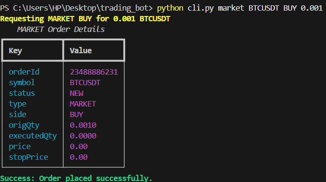

# Binance Futures Testnet Trading Bot

Welcome to the **Binance Futures Testnet Trading Bot**! This is a simplified command-line application (CLI) written in Python that allows you to easily place Market, Limit, and Stop orders on the Binance Futures Testnet (USDT-M). 

It is designed with beginners in mind, providing a clean code structure, beautiful terminal outputs, robust error handling, and comprehensive logging.

---

## 🚀 Getting Started (Beginner's Guide)

Follow these simple steps to set up the bot on your computer.

### 1. Prerequisites
- **Python 3.9 or higher**: Make sure you have Python installed. You can check by running `python --version` in your terminal.
- **Binance Testnet Account**: You need an API Key and Secret Key from the [Binance Futures Testnet](https://testnet.binancefuture.com).

### 2. Installation
Open your terminal (Command Prompt, PowerShell, or Terminal), navigate to this project folder, and run the following commands:

**Step A: Create a Virtual Environment (Optional but highly recommended)**
This creates a separate workspace for this project's dependencies.
```bash
# On Windows
python -m venv venv
.\venv\Scripts\activate

# On Mac/Linux
python -m venv venv
source venv/bin/activate
```

**Step B: Install Dependencies**
Install all the required Python packages (like `python-binance`, `typer`, and `rich`):
```bash
pip install -r requirements.txt
```

### 3. Configuration
We use a `.env` file to securely store your API keys.
1. Create a new file in this folder and name it EXACTLY `.env`.
2. Open the `.env` file in any text editor and paste your credentials like this:
```env
BINANCE_API_KEY=your_api_key_here
BINANCE_SECRET_KEY=your_secret_key_here
```
*(Make sure there are no spaces around the `=` sign!)*

---

## 🧪 How to Test the Bot (Manual Test Cases)

Now that you're set up, you can test all the features! Here are the exact commands you can copy and paste to verify the bot works perfectly.

### Test Case 1: Place a MARKET Order (BUY)
This will instantly buy 0.001 BTC at the current market price.
```bash
python cli.py market BTCUSDT BUY 0.001
```
**Sample Output:**
*(If successful, you will see a beautifully formatted table like the one below, displaying your `orderId`, `status: NEW`, and `type: MARKET`)*


*(Please place your response image in the folder and name it `sample_response.png` to view it here, or refer to the image you attached!)*

### Test Case 2: Place a MARKET Order (SELL)
This will instantly sell 0.001 BTC at the current market price.
```bash
python cli.py market BTCUSDT SELL 0.001
```

### Test Case 3: Place a LIMIT Order
This will place an order to buy 0.001 BTC only if the price drops to 50,000. It will likely stay "Open" because the price is far below the current market.
```bash
python cli.py limit BTCUSDT BUY 0.001 50000
```

### Test Case 4: Place a STOP_MARKET Order (Bonus Feature!)
This places a trigger order. It will execute a market buy *only if* the price reaches 70,000.
```bash
python cli.py stop BTCUSDT BUY 0.001 70000
```

### Test Case 5: Test Error Handling (Invalid Input)
Let's see how the bot protects you from making mistakes! Try entering a negative quantity:
```bash
python cli.py market BTCUSDT BUY -5
```
**Expected Result:** The bot will catch this and print an error in red: `Failed to place MARKET order: quantity must be greater than 0`.

### Test Case 6: Test Error Handling (Invalid Symbol)
Try trading a symbol that doesn't end in USDT:
```bash
python cli.py market BTCUSD BUY 0.001
```
**Expected Result:** The bot will stop you and print: `Failed to place MARKET order: Symbol must end with 'USDT' (e.g., BTCUSDT)`.

---

## 📂 Project Structure

For developers looking to explore the code, here is how the bot is organized:
- `cli.py`: The main entry point. It uses `typer` to handle all the terminal commands and `rich` to print those nice tables.
- `bot/client.py`: Handles securely connecting to the Binance Testnet.
- `bot/orders.py`: Contains the actual logic that talks to Binance to place Market, Limit, and Stop orders.
- `bot/validators.py`: The security guards! These functions ensure you don't enter bad data (like negative prices).
- `bot/logging_config.py`: Sets up a logger. Every time you run a command, the raw data is saved silently in the background to `trading_bot.log`. 

## 📋 Checking Logs
Want to see the raw API responses? Open the `trading_bot.log` file in this folder. It keeps a permanent record of every request sent and every response received, making it incredibly easy to debug issues!
